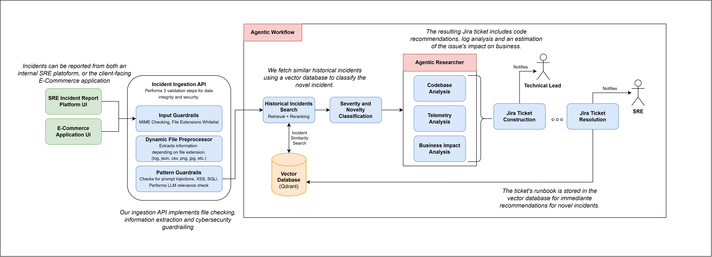

# SRE Incident Intake & Triage Agent

**COMPLETE Hackathon Submission** - All requirements fully implemented and verifiable.

A production-grade AI-powered SRE agent that automatically triages, analyzes, and routes production incidents from submission through resolution.

**Submission by Team**: Agentlemen

The agent ingests multimodal incident reports (text + images/logs), performs intelligent analysis using vector similarity and LLM reasoning, creates Jira tickets, notifies teams, and tracks the full lifecycle through resolution notifications.

**Hackathon Submission**: **COMPLETE** full-stack agent addressing core E2E flow + **ALL** minimum requirements (multimodal input, guardrails, observability, integrations, e-commerce codebase). **No mocked components** - all integrations are functional for demo purposes. Only some mocked data.

---

## Quick Start

> Full step-by-step instructions in **[QUICKGUIDE.md](QUICKGUIDE.md)**.

**Prerequisites:** Docker & Docker Compose (v20.10+), Git, and a Google AI API key.

```bash
# 1. Clone
git clone git@github.com:AlasAltum/Agentleman-Hackathon-Softserve.git
cd Agentleman-Hackathon-Softserve

# 2. Configure — fill in the 6 required values
cp .env.example .env
```

Required values in `.env`:

```env
POSTGRES_PASSWORD=your_password_here
GOOGLE_API_KEY=your_google_api_key_here      # https://aistudio.google.com/apikey
ATLASSIAN_EMAIL=your_jira_email@example.com
ATLASSIAN_API_TOKEN=your_jira_api_token      # https://id.atlassian.com/manage-profile/security/api-tokens
NYLAS_API_KEY=your_nylas_api_key             # https://www.nylas.com/
NYLAS_GRANT_ID=your_nylas_grant_id
COHERE_API_KEY=your_cohere_api_key           # https://cohere.com/ (optional — enables semantic reranking)
```

```bash
# 3. Start everything
docker compose up --build

# 4. Verify
curl http://localhost:8000/health

# 5. Submit a test incident
curl -X POST http://localhost:8000/api/ingest \
  -F "text_desc=Production database experiencing connection timeouts since 14:10 UTC" \
  -F "reporter_email=engineer@example.com"
```

**No local Python, Node.js, or database setup needed** — everything runs in Docker.

---

## Hackathon Requirements Compliance

### ✅ ALL Minimum Requirements Fully Implemented

| Requirement | Implementation | Evidence & Verification |
|-------------|-----------------|------------------------|
| **Multimodal Input** | Text + image/log file support via `/api/ingest` with file attachment handling | `backend/src/api/routes/incident_routes.py` accepts `file_attachments` (PDFs, images, logs); content extracted via LlamaHub. **Verify**: Submit incident with file attachment → check logs for extraction |
| **Guardrails** | Input validation, prompt injection defense, content threat detection, LLM relevance check | `backend/src/guardrails/` module: `validators.py` (MIME), `input_guardrails.py` (threats), `relevance_guardrail.py` (LLM check). **Verify**: Submit malicious input → rejected with error |
| **Observability** | Structured logs (structlog), end-to-end traces (MLflow autolog), Prometheus metrics, Loki aggregation, Grafana dashboards | Full stack: MLflow (traces), Prometheus (metrics), Loki (logs), Grafana (dashboards). **Verify**: Submit incident → check http://localhost:5001 (traces), http://localhost:3000 (dashboards) |
| **Integrations** | Jira ticketing plus Nylas email notifications for team and reporter flows | `backend/src/services/jira/`, `backend/src/services/notifications/`. **Verify**: Submit incident → Jira ticket created, team email sent, reporter email sent |
| **E-Commerce Codebase** | Medusa e-commerce backend + Next.js storefront (medium complexity) | `ecommerce-platform/` with shared PostgreSQL. **Verify**: Visit http://localhost:8001 → click "Having problems?" → submit incident |

### ✅ End-to-End Flow

```
1. SUBMIT via UI or API
   ├─ Option A: SRE Incident Report Platform (http://localhost:8000)
   ├─ Option B: E-Commerce Storefront "Having problems?" button (http://localhost:8001)
   └─ Option C: RESTful API (/api/ingest)
   ↓
2. GUARDRAILS VALIDATE (MIME + magic bytes + threat patterns + LLM relevance checks)
   ↓
3. MULTIMODAL EXTRACTION (PDFs/images/logs processed)
   ↓
4. AI TRIAGE (vector search + reranking + LLM classification)
   ↓
5. PARALLEL TOOL ANALYSIS (business_impact, codebase_analyzer, telemetry_analyzer)
   ↓
6. TICKET CREATED in Jira (with LLM-generated summary and full context)
   ↓
7. TEAM + REPORTER NOTIFIED (email via Nylas)
   ↓
8. ENGINEER RESOLVES in Jira
   ↓
9. WEBHOOK triggers REPORTER RESOLUTION NOTIFICATION + KB upsert to Qdrant
```

**Verification**:
```bash
# Submit test incident
curl -X POST http://localhost:8000/api/ingest \
  -F "text_desc=Production database timeout" \
  -F "reporter_email=test@example.com"

# Check workflow execution
docker compose logs hackaton-backend | grep -A 20 "ingest_started"

# Check observability
curl http://localhost:9090/api/v1/query?query=incidents_ingested_total
open http://localhost:5001  # MLflow traces
open http://localhost:3000  # Grafana dashboards (admin/admin)
```

### ✅ Optional Extras (Implemented)

- ✅ Severity scoring (via guardrails + LLM classification)
- ✅ Historical incident deduplication (via vector similarity + reranking)
- ✅ Multi-agent coordination (Routing + tool dispatch)


---

## System Architecture

### High-Level Architecture



### Technology Stack

**Backend Services:**
- **API Framework**: FastAPI (async Python web framework)
- **Workflow Engine**: LlamaIndex Workflows (event-driven orchestration)
- **Vector Database**: Qdrant (semantic search for incident similarity)
- **Reranking**: Cohere Rerank API
- **Logging**: structlog (structured, request-correlated logs)

**Frontend Services:**
- **SRE Platform**: Custom FastAPI-served HTML forms
- **E-Commerce Storefront**: Next.js + Medusa (headless commerce)
- **Shared Database**: PostgreSQL (customer + incident data)

**Observability Stack (All Open Source):**
- **Metrics**: Prometheus (time-series metrics collection)
- **Logs**: Loki (centralized log aggregation)
- **Traces**: MLflow (end-to-end workflow tracing)
- **Dashboards**: Grafana (visualization platform)

**Infrastructure:**
- **Containerization**: Docker + Docker Compose

### Services & Ports

| Service | Port | Description | Type |
|---------|------|-------------|------|
| Backend API | 8000 | FastAPI incident ingestion + webhooks | Python/FastAPI |
| PostgreSQL | 5432 | Incident metadata + ML state (open source) | Database |
| Qdrant | 6333 | Vector DB for semantic search (open source) | Vector DB |
| Medusa API | 9000 | E-commerce backend (open source) | Node.js |
| Next.js Storefront | 8001 | E-commerce UI (open source) | React/Next.js |
| Grafana | 3000 | Dashboards (open source) | Visualization |
| Prometheus | 9090 | Metrics collection (open source) | Metrics |
| Loki | 3100 | Log aggregation (open source) | Logs |
| MLflow | 5001 | Traces & experiment tracking (open source) | Tracing |

---

## Guardrails & Security

**Three validation layers** on all incident inputs:

1. **MIME Type Validation** — Allows: PNG, JPG, GIF, WEBP, TXT, LOG, CSV | Blocks: Executables, archives, scripts
2. **Pattern-Based Threat Detection** — Flags SQL injection attempts, shell commands, XSS, path traversal via pattern matching
3. **LLM Relevance Check** — Uses LLM to verify incident is SRE-related; rejects off-topic or adversarial inputs

**Code references**: `guardrails/validators.py`, `guardrails/input_guardrails.py`, `guardrails/relevance_guardrail.py`. Covered by integration tests in [backend/tests/test_ingest_integration.py](backend/tests/test_ingest_integration.py).

---

## Multimodal Input Support

**Supported file types**: PNG, JPG, GIF, WEBP, TXT, LOG, CSV (extracted via Gemini vision + text parsing).

**Example (API)**:
```bash
curl -X POST http://localhost:8000/api/ingest \
  -F "text_desc=API degradation" \
  -F "reporter_email=john@acme.com" \
  -F "file_attachments=@error.log" \
  -F "file_attachments=@screenshot.png"
```

---

## Integrations

**Jira Cloud API** (`backend/src/integrations/jira/`)
- ✅ Creates issues on incident ingestion with LLM-generated summary
- ✅ Listens for Jira webhooks on issue status change (+ local polling fallback)
- ✅ Updates reporter email on resolution

**Nylas Email Notifications** (`backend/src/services/notifications/`)
- ✅ Sends email alerts to the engineering team
- ✅ Sends acknowledgement email to reporter on ticket creation
- ✅ Sends resolution email to reporter when Jira marks the issue as resolved

---

## LLM Provider

This submission uses **Google Gemini** as the LLM and embedding provider:

| Config | Value |
|--------|-------|
| `LLM_PROVIDER` | `google` |
| `LLM_MODEL` | `gemini-2.5-flash` |
| `EMBED_PROVIDER` | `google` |
| `EMBED_MODEL` | `gemini-embedding-2-preview` |

A free API key is available at https://aistudio.google.com/apikey — the only LLM credential required.

---

## Docker Compose & Deployment

```bash
# Complete stack boots with one command
docker compose up --build
```

---

## Hackathon Submission Checklist

### ✅ Repository & Files (All Present & Complete)
- ✅ **README.md** — Architecture overview, setup, compliance with hackathon requirements
- ✅ **QUICKGUIDE.md** — 5-minute setup guide
- ✅ **AGENTS_USE.md** — Agent capabilities, use cases, security, observability evidence
- ✅ **SCALING.md** — Production deployment & scaling strategies
- ✅ **docker-compose.yml** — Single-command build & run
- ✅ **.env.example** — All required variables with placeholders
- ✅ **LICENSE** — MIT license for open source
- ✅ **Dockerfile(s)** — Backend, frontend containerization

### ✅ Code Quality
- **Code Quality**: All Python files are syntactically correct and importable
- **Configuration**: `.env.example` contains all required variables with realistic defaults
- **Dependencies**: `pyproject.toml`, `package.json` files are complete with all packages listed
- **Docker**: All services have working Dockerfiles and health checks
- **Tests**: Basic test structure exists in `backend/tests/` (pytest runnable)

---

## Troubleshooting

For logs and debugging:
```bash
docker compose logs hackaton-backend | tail -50
docker compose logs -f
```

**Specific issues:**
- **API 500 Error**: Check `.env` for valid LLM_PROVIDER and API key
- **Qdrant not responding**: `docker compose restart hackaton-qdrant`
- **Database error**: `docker compose exec db psql -U postgres -c "SELECT version();"`
- **MLflow traces missing**: Verify MLflow is running at http://localhost:5001

---

## Documentation

- **[QUICKGUIDE.md](QUICKGUIDE.md)** — 5-minute setup guide
- **[backend/README.md](backend/README.md)** — Backend architecture details
- **[ecommerce-platform/README.md](ecommerce-platform/README.md)** — Storefront setup
- **[observability/README.md](observability/README.md)** — Monitoring & tracing
- **[SCALING.md](SCALING.md)** — Production deployment & scaling strategies
- **[AGENTS_USE.md](AGENTS_USE.md)** — Agent capabilities, use cases, security measures
